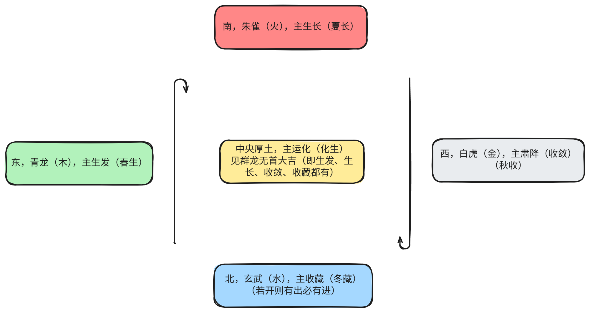

## 1黄帝内经总纲

### 一、人体的生命力与活力（生命医学）

魄力：魄为肺之神，力则来自于腰（肾精）

精神：肾最基本的物质为精，心之神为神，所谓“精神指的是心神相交的能力。

胆识：胆主决断

意志：意是脾的外显，因为脾主运化，关联性就是指意。志是肾之明，肾主收藏。所以意志力指的是运化和收藏的能力。

聪明：肾开窍于耳，肝开窍于目。

### 二、目标

天人合一：人体小宇宙与自然的大宇宙的和谐。

1.人身难得

懂得了人体，就懂得了人生的很多方面。

身体是革命的本钱，是借假修真的载体，是要蓄之养之的精品。

2.真法难闻

有缘才能听闻。

斋戒：保持精神上不要那么多的私心杂欲，实现至善。

圣王也要抱着很认真的态度去学习，既要修心也要修身。

3.中国难生

只有中国有这么多的经典去读，去反省人生，要常怀感恩。

### 三、中医五行方位

买东西不买南北：东西为木金，可为人类所用，南北为水火，可能给人带来伤害。

东方（木）——生发【春生】【仁，生发善心】

- **属性**：木性曲直，主春气，阳气始升，万物萌动。
- **功能**：疏泄、条达、向上向外。对应人体肝、胆，主疏泄，促气血运行。
- **经典依据**：《素问·阴阳应象大论》“东方生风，风生木……其在脏为肝”。春生之气，助万物发芽。

南方（火）——生长（疏布）【夏长】【义，疏散而不求回报】

- **属性**：火性炎上，主夏气，阳气隆盛，万物蕃秀。
- **功能**：温煦、长养、升腾。对应心、小肠，主血脉，推动全身兴奋与生长。
- **经典依据**：“南方生热，热生火……其在脏为心”。夏长之气，使植物开花结果，人体代谢旺盛。

西方（金）——收敛（肃降）【秋收】【礼，人性的收敛】

- **属性**：金性从革，主秋气，阳气渐收，阴气渐长。
- **功能**：沉降、清肃、收敛。对应肺、大肠，主宣发肃降，调节气机与津液。
- **经典依据**：“西方生燥，燥生金……其在脏为肺”。秋收之气，使万物成熟定型，人体气血内敛。

北方（水）——闭藏【冬藏】【智，志】

- **属性**：水性润下，主冬气，阳气潜藏，万物蛰伏。
- **功能**：封藏、滋润、下行。对应肾、膀胱，主藏精，为生命本源。
- **经典依据**：“北方生寒，寒生水……其在脏为肾”。冬藏之气，为来年生发储备能量。

中央（土）——运化（化生）【信，像土地一样真实可靠】

- **属性**：土性稼穑，主长夏，四时之中，承载万物。
- **功能**：生化、承载、受纳。对应脾、胃，主运化水谷精微，为气血生化之源。
- **经典依据**：“中央生湿，湿生土……其在脏为脾”。土旺四时，化生万物，调节各方位之间的转化。

#### 图示总结

| 方位 | 五行 | 季节 | 气机运动 | 对应脏腑 | 主要作用           |
| :--- | :--- | :--- | :------- | :------- | :----------------- |
| 东   | 木   | 春   | 生发     | 肝胆     | 升发阳气，疏泄条达 |
| 南   | 火   | 夏   | 生长     | 心小肠   | 温煦长养，推动代谢 |
| 西   | 金   | 秋   | 收敛     | 肺大肠   | 肃降清肃，气机内收 |
| 北   | 水   | 冬   | 闭藏     | 肾膀胱   | 封藏精气，滋养根基 |
| 中   | 土   | 长夏 | 运化     | 脾胃     | 生化气血，枢纽四旁 |

**重要：**

第一点：一定要清楚自己在哪个点位上，最好就是四个点位都有（见群龙无首，吉），然后根据点位去做事。

第二点：健康长寿不靠别的，就靠自己。健康是一个积精累气的过程，吃好睡好、消化吸收都有了就健康。调理好身体和生活才能调理好人。

第三点，天人合一。自然法则在人体上都会有体现，有诸内必形诸外。

### 四、人体中部与“人中”的奥秘

1. **人体中部不在肚脐**
   - 肚脐为“神阙穴”，连先天后天，但非中部；只宜灸，不宜针。
   - **人中穴**才是人体中部。
2. **人中的中医原理**
   - 是**任脉**（主血，最大阴经）与**督脉**（主气，最大阳经）的交汇点。
   - 昏倒时掐人中，是因昏倒为“阴阳离绝”之象（痞卦）；掐人中使用任督二脉重新交通，转为“阴阳和合”之象（泰卦）。
   - 人中别名“寿宫”、“子庭”，看**寿命、生育能力**：以**深、长、宽**为佳，代表气血交通能力强，肾精足。人中形态可变化，糟蹋身体则变平；养生调养可变深。

### 五、日常生活中的养生智慧

1. **“冬吃萝卜，夏吃姜”**
   - 夏：阳气外越，体内虚寒，宜吃姜等温散之物。
   - 冬：阳气内收，体内蕴热，宜吃萝卜顺气，保持清凉通畅。
2. **仁义礼智信与五脏**
   - **仁**：东方，生发之机，一点善念可影响深远。
   - **义**：主“散”，白送不图回报（如两肋插刀）。
   - **礼**：西方，主收敛、约束人性。
   - **智**：肾精的外现，智慧与肾精相关。
   - **信**：中央脾土，人言为信，如土地般真实可靠。
3. **肾精与志向**
   - 肾藏志，肾精足则志向高远（如小孩子志气高）。
   - 肾精不足则志向变小（只求赚钱、生计）。
   - 年老精衰则“能活着就行”。